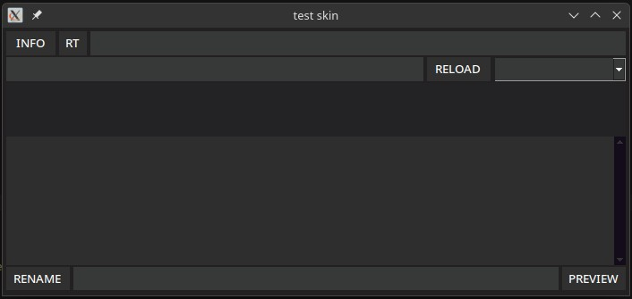

# renov-tk

utilidad para renombrar video basico, agregando info del video al nombre



## librerias
**yaml**

para leer el archivo de configuraciones

```bash
pip install pyyaml
```

**pymediainfo**

```bash
pip install pymediainfo
```

